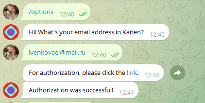
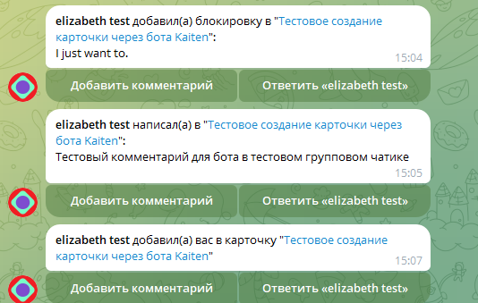
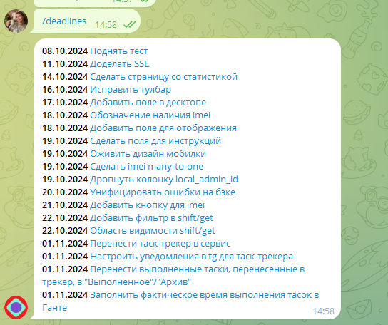

# Настройка телеграм-бота

У Kaiten есть официальный телеграм-бот, в котором можно авторизоваться и настроить его под себя: @KaitenBot

Через бота можно получать уведомления из системы, а также создавать новые карточки.

## Авторизация в боте

## Основные команды:

- **/deadlines** - вывести дедлайны по всем карточкам списком. *Нюанс*: когда я тестировала эту фичу с другого аккаунта без админских прав, команда выводила только задачи с пометкой "Срочно". (не знаю, баг это или фича)
- **/subscriptions** - настройка получения уведомлений о различных событиях в разных досках. Единственный минус - на каждой доске нужна отдельная настройка уведов.

## Создание карточки
Чтобы создать карточку через бота, необходимо просто написать текст заголовка карточки боту и следовать инструкциям:

##  Пример полученных уведомлений
При происхождении каких-то событий бот автоматически присылает Вам сообщение:

## Пример вывода дедлайнов
