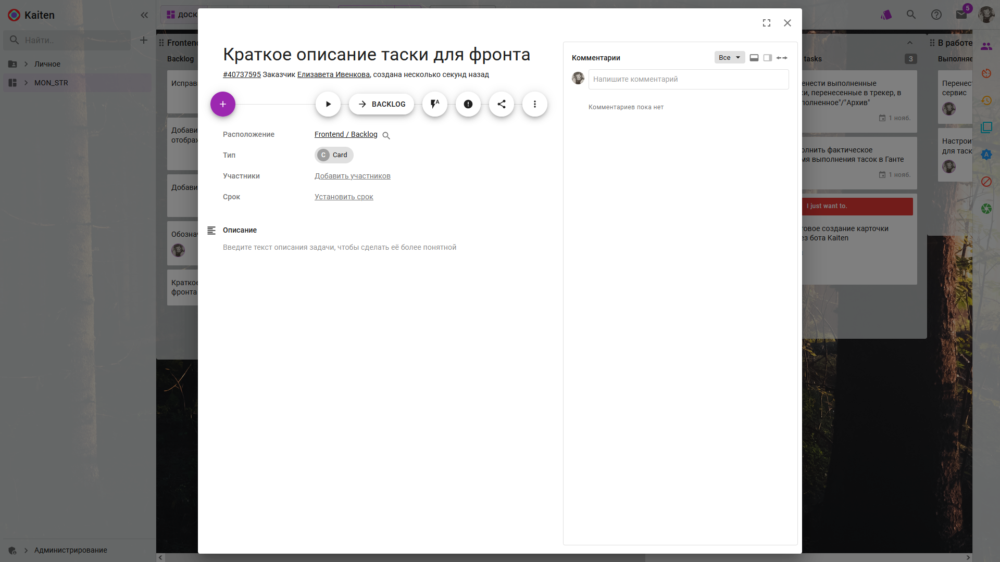

# Карточки

> Одна карточка = одна задача

## Создание карточки

Карточку можно создать:

- через меню списка:

- пролистав в конец очереди и наведя курсором на свободное поле:

Далее достаточно ввести краткое описание таски.

## Настройки карточки

Для дополнительных настроек нужно открыть карточку, щелкнув по ней:

- Опционально: добавить описание &rarr; Сохранить
- Опционально: добавить участников
- Опционально: добавить метку 

- Опционально: добавить срок &rarr; Применить 

> Готовые карточки свободно перемещаются по всем очередям доски курсором с зажатой ЛКМ.

> Внутри карточки можно писать комментарии и отвечать на них.

## Добавление карточки в очередь

- Заголовок очереди &rarr; + &rarr; Создать карточку
или
- навести курсор в конец списка &rarr; Сформулируйте задачу