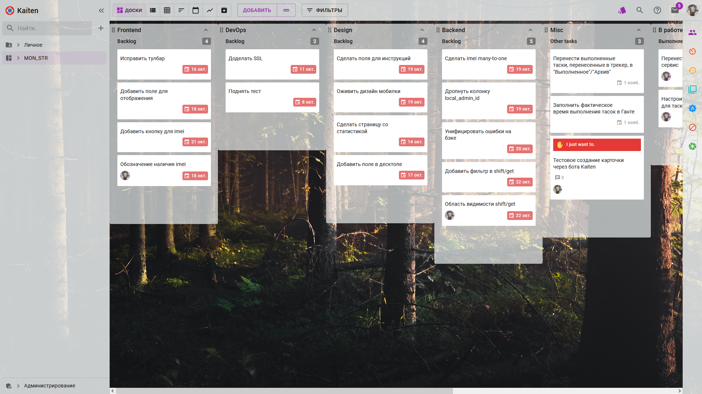
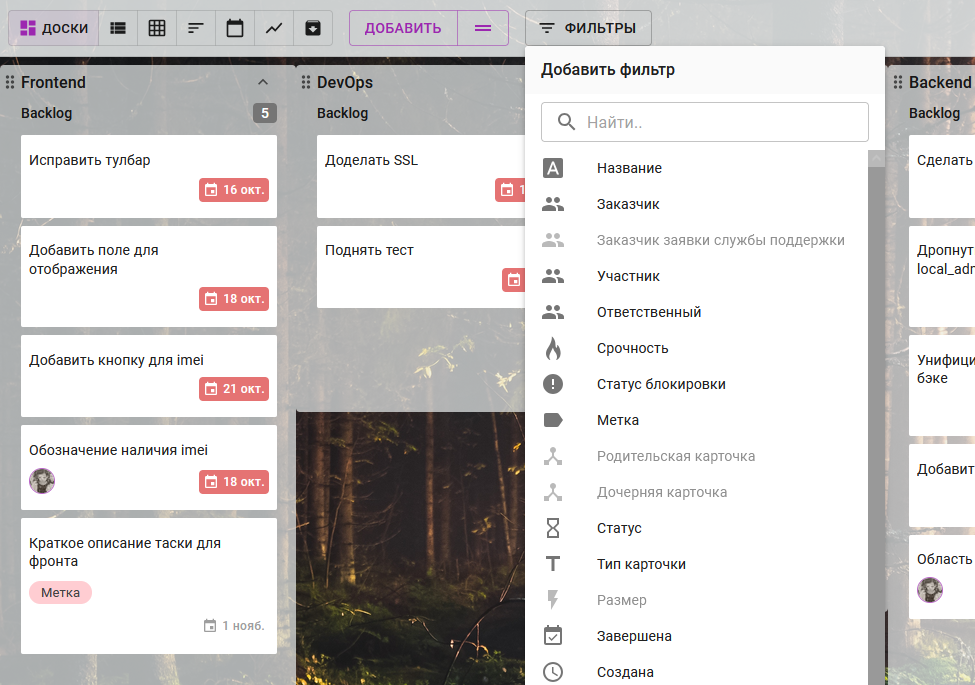

# Пространства

Основная сущность в системе - это пространство, одна большая доска, по которой можно перемещать карточки.

На одно пространство приходится один проект.

В пространство можно добавлять подпространства, папки и файлы.

> На данный момент часть данных из телеграма перенесена в отдельные файлы (в частности, там есть документы с информацией о подключении и ссылкой на фигму)

## Изменить фон пространства
Левый столбец меню &rarr; Пространство &rarr; Меню (три точки) &rarr; Изменить фон пространства

## Метки

В рамках пространства можно назначать карточкам различные тэги (метки).
Добавление метки для карточки:
Карточка &rarr; + &rarr; Метки &rarr; *Выберите метку из имеющихся или создайте новую (просто введите текст)*

## Фильтры

В пространстве возможно оставить в поле зрения только те карточки, соответсвующие фильтру.

Верхняя панель &rarr; Фильтры &rarr; Выбрать нужный фильтр

Можно добавить неограниченное количество фильтров. На доске будут показаны все очереди с карточками в них, которые соответствуют критериям фильтрации.

